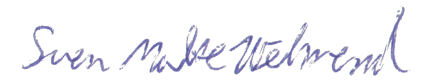

= Sven Malte Wehrend
:doctype: article
:icons: font
:icon-set: fas
:pdf-themesdir: .
:nofooter:

[cols="20%a,80%a", frame=none, grid=none]
|===
| image::wehren_edit_2020.jpg[width=100]
| icon:map-marker[] Eythstrasse 20, 12105 Berlin, Germany +
icon:mobile[] 0176 215 86 919 +
icon:envelope[] sven.wehrend[at]gmail.com +
icon:linkedin[set=fab] https://www.linkedin.com/in/sven-wehrend-a00422149 +
icon:globe[] https://wehrend.github.io/portfolio +
*Born:* Nov. 21, 1987
|===

== Work Experience

[cols="20%,80%", frame=none, grid=none]
|===

| June 2023 – Feb. 2026
| *Software Developer* — Odoo Developer, tec connect
 Creation and administration of custom specific modules for Odoo versions 13 - 19

| Sep. 2019 – June 2023
| *Software Developer* — Development of custom modules for the company's ERP system (OpenERP/Odoo), eemagine
 Creation and administration of custom specific modules for Odoo version 12

| Dec. 2017 – Dec. 2018
| *Software Developer* — Development of a web-based accounting software, Content Licence Agency (CLA)

| June 2016 – Sep. 2017
| *Student Assistant* — Development of VR experiments based on Unity3D/C#, TU Berlin, Biological Psychology and Neuroergonomics (BPN)
 Creation of the SAMOBI project (Situational Awareness Mobile) based on Unity and C#

|===

== Education

[cols="20%,80%", frame=none, grid=none]
|===
| March 2023 – present
| *Software Developer* — Weiterbildung / Advanced Training Frontend, DevKarriere.de

| Oct. 2013 – Oct. 2018
| *Technische Informatik (MSc.)* — TU Berlin +
Grade: 2.7 +
_Master Thesis:_ "Piloting of a Situational Awareness Framework and Adaption of an EEG-Processing Pipeline" +
Supervisor: Prof. Dr. Klaus Gramann — Date: September 28, 2018 — Grade: 3.3
 An evaluation of eye-tracking data and processing in Matlab

| Oct. 2008 – Sep. 2013
| *Computer Engineering (B.Eng.)* — HTW Berlin +
Grade: 2.3 +
_Bachelor Thesis:_ "Implementierung eines neuronalen Netzes in Hardware" +
Supervisor: Dipl.-Ing. Gunnar Schoel — Date: September 23, 2013 — Grade: 2.3

|===

== Languages

[cols="25%,75%", frame=none, grid=none]
|===
| German  | Mother tongue
| English | Fluent — Ger B2
|===

== Qualifications & Technical Skills

=== Common

[cols="25%,75%", frame=none, grid=none]
|===
| Operating Systems | Linux (Debian-based) • Windows 10
| Tools             | PyCharm • Microsoft Code • PostgreSQL • Docker • Asciidoctor • Hugo
|===

=== Programming Languages

* Python, SQL, C#
* React, TypeScript, HTML, CSS, JavaScript

== Completed Projects

[cols="20%,80%", frame=none, grid=none]
|===
| 2026
| *Modular Synthesizer* — Browser-based modular synthesizer (React, TypeScript, Tone.js, AudioWorklet) +
Final project for the Frontend Advanced Training; physically modeled filter/VCO modules, Supabase-backed patch storage +
https://wehrend.github.io/modular-synth

| 2025
| *Betriebswirtschaftliche Auswertung (BWA)* — Implementation of an Odoo based BWA module (Python, PostgreSQL, Odoo 19) as part of the job at Tec Connect 
|===

== Soft Skills

* Intellectual curiosity
* Creative and systemic thinking

== Further Interests

Psychology • Sustainability •  Synthesizer

---

_Berlin, 3. September 2026_

